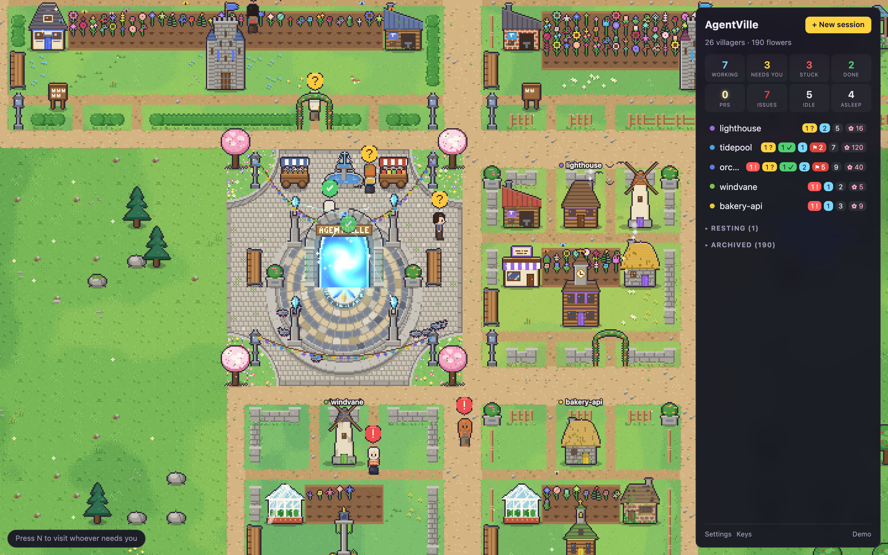
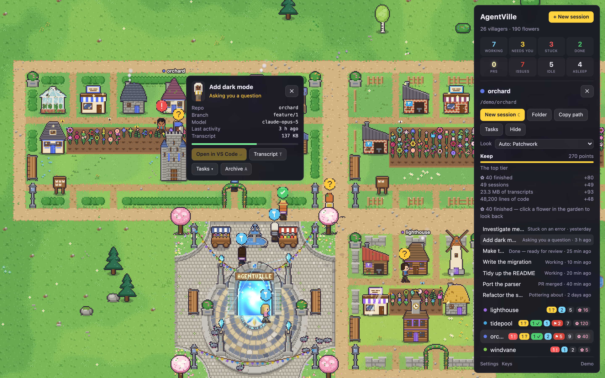
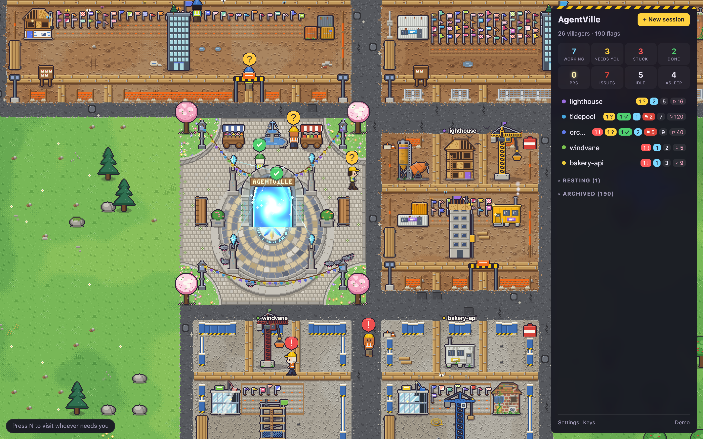
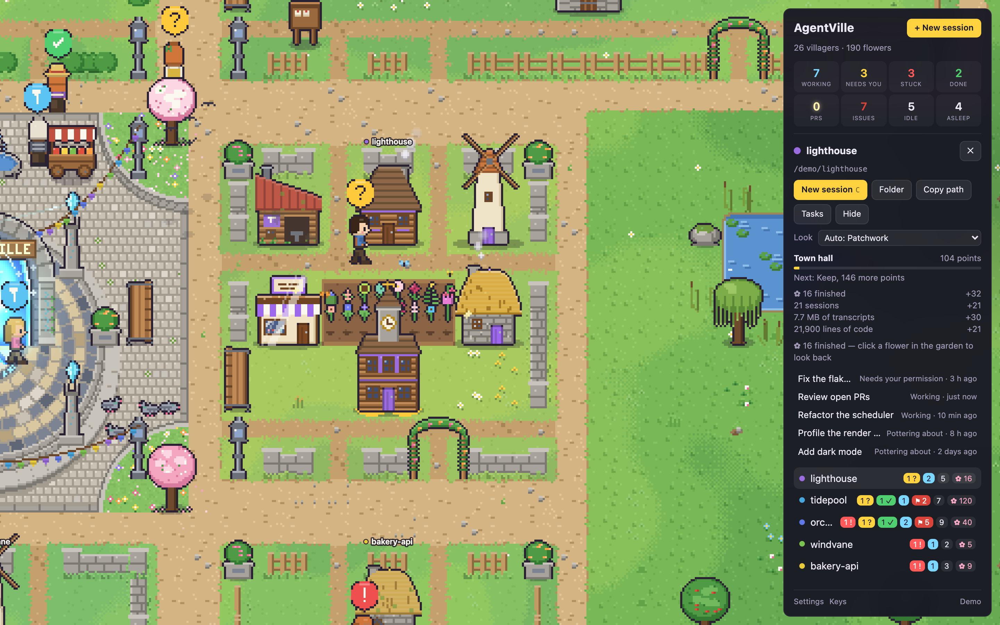
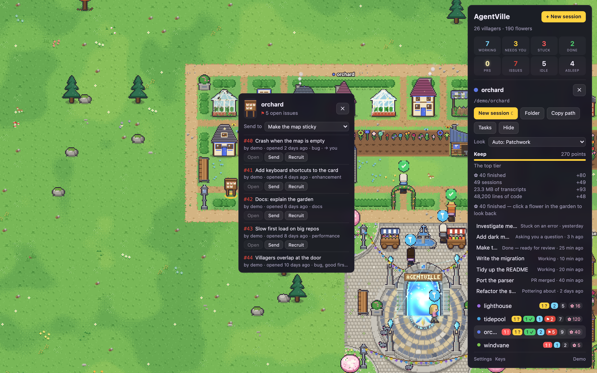

# AgentVille

[](https://github.com/CarolineChiari/AgentVille/actions/workflows/build.yml)
[](https://github.com/CarolineChiari/AgentVille/releases/latest)
[](LICENSE)



Every Claude Code session on this machine is a villager in a small pixel-art village. Each repo
you work in is a plot of land; each session is one villager building something on it. When a
session is waiting on you the villager stops and holds a `?` over its head. Click it and the
thread opens in the Claude desktop app.

It reads Claude Code's own session files, on your own machine. Nothing is uploaded, there is
no account, and it never writes to Claude Code's files. Everything it writes goes in `data/`.
The one thing that touches the network is the PR gardens and issue boards, which ask GitHub
through your own `gh` login; turn them off in Settings and nothing leaves the machine.

## Run it

```bash
npm install
npm run dev
```

Then open the URL Vite prints (default `http://127.0.0.1:5274`). Add `?demo=1` for a made-up village that needs no sessions. Needs Node 22 or newer.
`npm test` runs the suite. `npm start` builds and serves the built app; `PORT=5300 npm start`
binds elsewhere.

### Desktop app

`npm run app` builds and opens AgentVille in its own window. `npm run dist` packages it for the
machine you're on into `release/`. Every push to `main` builds the Mac (`.dmg`, Apple silicon
and Intel) and Windows (installer and portable `.exe`) apps in GitHub Actions; they're on the
run's page under **Artifacts**. Every commit bumps the minor version in `package.json`
(`npm version --no-git-tag-version minor`), and a push whose version has no `v<version>` tag yet
publishes the apps as that release and tags the commit.

The app is the same server and page as `npm start`, on port 5275 so it can run alongside
`npm run dev`. Its `data/` lives in `~/Library/Application Support/AgentVille/` (macOS) or
`%APPDATA%\AgentVille\` (Windows) instead of the repo.

The builds aren't signed with a developer certificate yet, so the first launch needs a nudge.
On macOS, right-click the app and choose **Open** (or run
`xattr -dr com.apple.quarantine /Applications/AgentVille.app`). On Windows, choose **More info →
Run anyway** in the SmartScreen prompt.

macOS and Windows are both supported. Opening a thread, starting a new session and revealing
a folder go through a deep link handed to the OS opener.

**Open in VS Code** is the default. AgentVille opens the repo folder in VS Code first, then hands
the session to the Claude Code extension (`vscode://anthropic.claude-code/open?session=…`), so it
lands in the right window. Threads that exist only in the Claude desktop app can't be opened
this way. Switch to the Claude app under Settings → Open threads in.

## What it reads

| | |
| --- | --- |
| CLI transcripts | `~/.claude/projects/<encoded-cwd>/<session>.jsonl` |
| Live sessions | `~/.claude/sessions/*.json` |
| Desktop app records | `~/Library/Application Support/Claude/claude-code-sessions/…` (macOS), `%APPDATA%\Claude\claude-code-sessions\…` (Windows) |

| Your repos | The files in each folder a session works in, to count its lines of code for its landmark. It skips whatever the repo's `.gitignore` does, lock files and anything binary, never follows a link, and stops after 20,000 files or 20 seconds. **Settings → Count the lines of code in each repo** turns it off |

Only ever read. Nothing in a repo is ever run: its lines are counted by reading its files, and
the counts are kept in `data/repos.json`, refreshed every half hour.

## What you are looking at

| In the village | In your sessions |
| --- | --- |
| One plot | One repo. Bigger repos claim more tiles, and a plot stays where it is between reloads |
| One villager + one building | One session |
| Hammering, sparks | Working right now |
| Waving and hopping with `?` | Needs you: a question, a plan to approve, or a permission prompt |
| Standing at the door with a green ✓ | Done: finished its turn, ready for you to review (`R` visits each, `V` marks it reviewed) |
| Slumped with `!` | Errored |
| Jumping with a gold ★ | PR merged, in the last three days |
| Sitting with `z` | Nothing for three days |
| Stepping out of the portal in the square | A session that just appeared |
| Walking back into the portal | You archived it |
| A flower in the plot's garden | A finished (archived) thread |
| A notice board below the garden | The repo's open GitHub issues, one pinned note each |
| A landmark in the middle of the garden | How much work the repo has seen: a campfire, then a well, a market cross, a chapel, a town hall, a keep |
| A lamp, a bench, planters, a rose arch in the fence | What each tier of landmark brings with it |
| Smoke from a chimney, lit windows after dark | Someone is in: working, or waiting on you |



Everything else is decoration, fixed per repo and per session so each stays recognisable: a
repo's fence, lawn, building materials and roof colours; each session's house or other building
and its villager's clothes; and the countryside of meadows, groves, rocks, orchards and ponds
between the plots. Butterflies, birds, cloud shadows and the golden light at sunrise and sunset
come and go on their own.

### Themes

**Settings → Theme** dresses the whole village: the countryside village it has always been, or a
construction site, where every plot is fenced off, each session's building is going up (a timber
frame, a tower crane, a site office, a digger in its pit), everybody works in a hard hat and
hi-vis, and finished work is a survey flag in each plot's setting-out yard instead of a flower in
its garden: a pennant for a bug fix, a chequered flag for data work, a windsock for research. Its
landmarks climb from a surveyor's peg to a tower topped out with a tree and the plot's flag.

Each theme has looks for its folders: a farmstead, a market town or a stone hamlet in the
village; new homes, a high-rise, roadworks, a restoration or an industrial park on the site. A
folder is handed one of the village theme's looks by its name, or **Settings → Every folder**
puts them all in one. Mix and match with **Look** in a folder's panel: it can wear any theme's
look, so a roadworks site can stand in a countryside village, and it keeps that look whatever
the village's theme becomes. What a building means (who's working, who needs you, what has
bloomed) is the same in every theme.



### Transcripts and new sessions

**Transcript** on a villager's card (or `T`) opens its conversation in a panel beside the map:
your prompts, Claude's replies, and one line for each tool call. It refreshes every few seconds
while the thread is working or waiting, and stays at the newest message if that's where you are.
It's read straight from the transcript file; nothing is sent anywhere.

**+ New session** (or `C`) picks a repo, or any folder, where to open it, the model, the effort
level, and an optional first prompt. The new villager steps out of the portal a few seconds later.

| Open in | Model and effort | First prompt |
| --- | --- | --- |
| VS Code | Your defaults (change them in VS Code's menus) | Typed in for you; press Enter to send |
| Terminal | Any model (Fable, Opus, Opus 1M, Sonnet, Haiku) and effort (low to max) | Sent as the opening message (macOS); on the clipboard (Windows) |
| Claude app | Your defaults | On the clipboard |

Only the terminal can take a model or an effort level, because neither the VS Code nor the
Claude app link has a way to pass them; picking either switches the form to Terminal. On macOS the terminal is started
from a one-shot script in `data/launch/` that deletes itself as it runs; the prompt is read from
a separate file, so nothing you type is ever run as a command.

A villager whose session has stopped on you, with a question, a plan to approve or a permission
prompt, shows `?` and says what it needs, even while its last transcript entry looks like work.
AgentVille reads this from the status each running Claude Code process keeps for itself.

**Notify me when a villager needs me**, in Settings, sends a desktop notification when a villager
stops on a question, a permission prompt or an error while the village is behind other windows.
It's off until you turn it on, and that's when the browser asks for permission. Several at once
come as one notification, a villager that stays waiting doesn't ring again, and clicking it
brings the village forward on that villager. Your own OS shows it; nothing is sent anywhere.

However many villagers need you is also in the tab's title, `(2) AgentVille`, whatever the
settings. In the desktop app it's on the Dock icon on macOS, and on the taskbar button as a small
yellow badge on Windows; answering them clears it.

### The gardens

Every finished thread leaves a flower in its repo's garden. Beds fill a row at a time, left to
right and round the landmark in the middle, and a full bed carries on in the plot's next cell,
so a repo you've done a lot in grows into a big garden. Empty slots show as bare soil.

There are 50 kinds of flower, and the kind says what the work was, read from the thread's title
and first prompt: daisies for bug fixes, tulips for features, lavender for docs, sunflowers for
performance, lilies for code review, dandelions for research, and so on. The colour is random,
but fixed per thread. Click a flower to look back at the thread, open it again, or restore it.

Villagers who need you wave and hop every few seconds, so they're easy to spot. A repo whose
threads are all asleep rests: its villagers fold away, but its garden stays on the map. The bed
is walkable, so villagers stroll among the flowers rather than queueing in front of their doors.

### Landmarks

In the middle of every garden stands what the work in that repo has raised. It starts as a
campfire and climbs, a tier at a time, to a well, a market cross, a chapel, a town hall and a
keep. When a repo reaches the next tier the new one goes up in front of you, foundations first,
and everybody on the plot gets confetti. Each tier also brings something to the plot's fence
line: a lamp, then a bench, planters at the corners, a rose arch over the gate, and a second lamp.

Points come from four kinds of work. A landmark never comes down: the tier a repo has reached is
kept in `data/village.json`, so turning PR gardens off or clearing out old transcripts costs it
nothing.

| Work | Points |
| --- | --- |
| A finished thread or a merged PR (a flower) | 2 each |
| A session, live or archived | 1 each |
| Transcripts | 1 per 250 KB, up to 1 MB of each session's |
| Lines of code in the repo | 1 per 1,000, up to 50 |

| Tier | Village | Construction site | Points |
| --- | --- | --- | --- |
| 0 | Campfire | Survey peg | 0 |
| 1 | Well | Site hut | 5 |
| 2 | Market cross | Scaffold tower | 15 |
| 3 | Chapel | Tower crane | 40 |
| 4 | Town hall | Concrete core | 100 |
| 5 | Keep | Topped out | 250 |

Click a landmark, or a repo in the sidebar, and its panel shows the tier, where the points came
from and how far it is to the next. A chapel or a town hall is built of the plot's own walls and
roofs, and flies the plot's colour; its windows light after dark and a campfire burns while
somebody on the plot is working or waiting on you, as a chimney smokes.



### Pull requests

If a repo's `origin` is on GitHub and the [`gh` CLI](https://cli.github.com) is installed and
signed in, its pull requests grow in the garden too:

- **Merged PRs** bloom in the order they merged. A finished thread that opened a PR shares that
  PR's flower rather than growing a second one.
- **Labels choose the flower.** `type:` labels are read before `area:` ones, `size:` labels pick
  a small, medium or large bloom, and a PR with no labels is always **white**. White never comes
  up as a random colour, so it only ever means "unlabeled".
- **Open PRs** wait at the growing edge of the bed as buds that **glitter** and glow, day and
  night. `P`, or the PRs count in the sidebar, flies to each in turn; the card opens the PR on
  GitHub. When it merges, the bud blooms.

Each repo's list is fetched with `gh pr list` at most every ten minutes, in the background, and
cached in `data/prs.json` so reloads are instant and it works offline. Closed-unmerged PRs grow
nothing.

### Open issues

The same way, a repo's open GitHub issues go up on a **notice board** on the walkway below its
garden, one pinned note per issue. `I`, or the Issues count in the sidebar, flies to each board
in turn. Click a board to list its issues, newest first:

- **Open** shows the issue on GitHub.
- **Send** hands it to a villager already on that repo, as a task that names the issue and links
  it. With several free, pick which one in the card. A busy villager can't take one.
- **Recruit** opens the new-session form on that repo with the issue already written in as the
  first prompt, for you to check and start.

Issues are fetched with `gh issue list` at most every ten minutes, one `gh` at a time alongside
the PRs, and cached in `data/issues.json`. A board only goes up on a plot that is already on the
map.



## Keys

| Key | Does |
| --- | --- |
| `N` | Fly to the next villager who needs you |
| `R` | Fly to the next finished thread to review |
| `P` | Fly to the next open PR |
| `I` | Fly to the next notice board with open issues |
| `Enter` / `A` / `V` | Open / archive / mark reviewed the selected thread |
| `C` | New session, with an optional first prompt |
| `T` | Transcript of the selected thread |
| `H` | Hide the panels |
| `Esc` | Deselect |
| Arrows, `+` / `-`, `0` | Pan, zoom, reset the view |

## Your own art

Every sprite is drawn in code at boot, so the app ships no images. To replace one with
a hand-drawn sheet, drop a PNG in `public/sprites/` and name it in `public/sprites/manifest.json`:

```json
{
  "version": 1,
  "sprites": {
    "villager.walk.s": { "src": "/sprites/villager.png", "frameW": 16, "frameH": 24, "frames": 4, "row": 2 }
  }
}
```

Anything not named there keeps its generated version.

To draw a whole new theme, follow `.claude/skills/new-theme/SKILL.md` (a Claude Code session picks
it up as the `new-theme` skill). `npm run sheet -- <theme>` draws every sprite of a theme, and a
sample plot in each of its sub-themes, into `data/sheets/<theme>.png`; `?demo&theme=<theme>&sub=<sub-theme>`
shows it in the app without changing your settings.

The screenshots in this README are the demo village, never a real one. `npm run shots` takes
them again into `docs/screenshots/`, in headless Chrome, Chromium or Edge (`CHROME=/path` picks
another browser).

## Keeping it local

The server binds `127.0.0.1`, refuses requests whose `Host` is not local (DNS rebinding), and
refuses state-changing requests that don't come from its own page: the exact `Origin`, port
and all, so another page on `localhost` can't either, and a JSON body, which a browser won't
send to another site without asking it first. No other page can put the village in a frame,
and the built app's page runs nothing but its own files. A bare `curl` POST needs
`-H 'Origin: http://localhost:5274' -H 'Content-Type: application/json'`, to that same host.

Found a way around any of that? Please report it privately, as [SECURITY.md](SECURITY.md)
describes, rather than in a public issue.

## Credits

AgentVille was inspired by [Bot Crossing](https://github.com/Station-Sciences/bot-crossing) by
Jarren Rocks ([botcrossing.com](https://botcrossing.com)), which turns your coding-agent threads
into a colony of little bots building on their repos' plots. AgentVille is a separate project,
and isn't affiliated with or endorsed by Bot Crossing.

## Licence

MIT. Copyright © 2026 Caroline Chiari; see [LICENSE](LICENSE).
