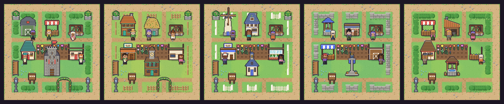
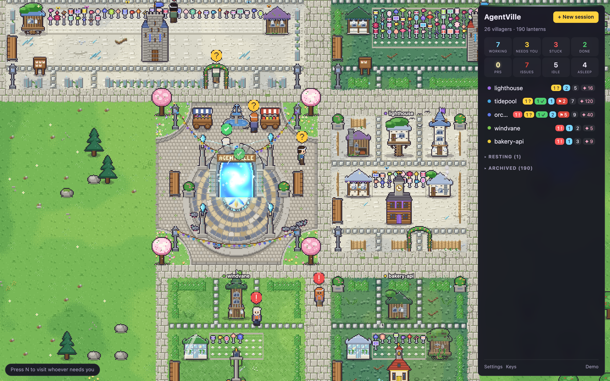
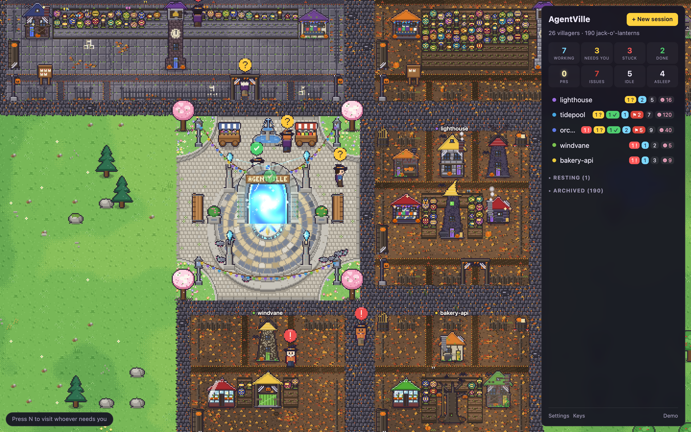

# Themes

A **theme** is the whole village's look. A **sub-theme** is one folder's take on it: each plot
wears one, so the repos in a village tell each other apart without leaving the theme.

- **Settings → Theme** dresses the whole village.
- **Settings → Every folder** puts every folder in one sub-theme instead of a spread.
- **Look**, in a folder's panel, gives that folder any theme's sub-theme and keeps it whatever the
  village becomes — so a roadworks site can stand in a countryside village.
- `?demo&theme=<id>` (and `&sub=<sub-theme>`) shows a theme over the demo village without saving
  anything.

Whatever a village wears, what things **mean** is the same: status badges, the selection ring, lit
windows and chimney smoke. Finished work may be drawn as something other than a flower, but it
still shows the kind of work, white for an unlabeled PR, and a bud for an open one. Every plot's
**landmark** climbs six tiers as the repo's work adds up; a theme names and draws its own, or
leaves the village's standing.

---

## Countryside village · `village`

The village it has always been: lanes, hedges, cottages and a flower per finished thread in each
plot's garden.



| Sub-theme | `id` | |
| --- | --- | --- |
| Patchwork | `patchwork` | A bit of everything: each repo its own mix of fences, walls and roofs |
| Farmstead | `farmstead` | Split-rail fences, weatherboard walls and a golden lawn |
| Market town | `market-town` | White pickets, brick and plaster fronts, warm roofs |
| Stone hamlet | `stone-hamlet` | Dry-stone walls, stone cottages and slate-blue roofs |
| Tudor lane | `tudor-lane` | Box hedges and half-timbered houses |

**Built from** — fences: rail, picket, stone, hedge · lawns: fresh, deep, golden · walls: plaster,
wood, stone, brick, timber · four families of roof colour.
**Finished work**: a **flower** in the **garden** (✿). **Work clothes**: their own.
**Landmark**: a campfire, a well, a market cross, a chapel, a town hall, a keep; each tier brings a
lamp, a bench, planters, a rose arch and a second lamp to the fence line.
**Handed out**: every folder gets Patchwork unless it picks otherwise, so a village nobody has
touched looks as it always has.

---

## Construction site · `construction`

Every plot fenced off and every session's building going up: a timber frame, a tower crane, a site
office, a digger in its pit.


| Sub-theme | `id` | |
| --- | --- | --- |
| New homes | `new-homes` | Timber frames and brick going up behind mesh fencing |
| High-rise | `high-rise` | Steel and glass on a concrete slab, cranes overhead |
| Roadworks | `roadworks` | Barriers, cones and fresh concrete, everybody in orange |
| Restoration | `restoration` | Old brick wrapped in scaffolding behind painted hoarding |
| Industrial park | `industrial` | Steel sheds, shipping containers and a batching plant |

**Built from** — fences: mesh, hoarding, barrier, netting · ground: gravel, dirt, sand, slab ·
walls: timber, brick, concrete, steel, glass · four families of machine paint.
**Finished work**: a **survey flag** in the **setting-out yard** (⚐) — a pennant for a bug fix, a
chequered flag for data, a windsock for research. **Work clothes**: a hard hat and hi-vis.
**Landmark**: a survey peg, a site hut, a scaffold tower, a tower crane, a concrete core, a tower
topped out with a tree and the plot's flag; the fence line gets a lighting mast, stacked boards,
cones and a barrier, and a site entrance.


---

## Elvish realm · `elvish`

A wood the elves keep: homes grown into living trees and carved from white stone under swept
roofs, ways paved in pale flagstones, lanterns lit for whatever is done.


| Sub-theme | `id` | |
| --- | --- | --- |
| Greenwood | `greenwood` | Homes grown into living trees under woven leaf canopies |
| Silver wood | `silverwood` | Birch and white stone under moonlit silver roofs |
| River hall | `riverhall` | Carved white halls and crystal glazing beside the water |
| Golden bough | `goldenbough` | Mallorn gold and deep leaf loam, everything lantern-warm |
| Thorn hold | `thornhold` | Briars, runestones and twilight violet over deep moss |

**Built from** — fences: woven withy, briar, mithril filigree, runestones · ground: glade, moss,
leaf loam, river sand · walls: livewood, birch, pale stone, woven leaf, crystal · four families of
roof colour.
**Finished work**: a **lantern** lit on its stand in the **lantern grove** (✦) — a teardrop lamp
for a bug fix, a rune lantern for data, a wisp for tests, a seeker's lamp for research.
**Work clothes**: a mithril circlet and a travelling cloak.
**Landmark**: a fairy ring of glowing toadstools, a moonstone, a star shrine, a silver tree, a
crystal hall, and the starwatch, a white tower with a star-crystal in its crown; the fence line
gets lanterns on crooks, a stone seat, urns of fern and toadstools, and two saplings grown into an arch.



---

## Halloween night · `halloween`

The last night of October: lanes of dark setts under the fallen leaves, gabled houses shingled and
boarded, a jack-o'-lantern on every step, and cobwebs in every corner.


| Sub-theme | `id` | |
| --- | --- | --- |
| Pumpkin patch | `pumpkin-patch` | Corn stooks, straw and leaf mould, and pumpkins everywhere |
| Haunted manor | `haunted-manor` | Tall shingled houses behind iron railings, boarded windows lit green |
| Graveyard | `graveyard` | Grey stone and wrought iron, headstones and fog in the hollows |
| Witch's hollow | `witchs-hollow` | Crooked daubed cottages, cauldrons on the boil and toadstools |
| Trick-or-treat lane | `trick-or-treat` | Cheerful brick fronts, paper bats and a string of orange lights |

**Built from** — fences: crooked pickets, wrought iron, corn stalks, a string of lanterns · ground:
frosted grass, leaf mould, turf under fog, old flagstones · walls: weatherboard, churchyard
granite, sooty brick, daub and timber, fish-scale shingles · five families of paint.
**Finished work**: a **jack-o'-lantern** carved and lit in the **pumpkin patch** (☻) — a grinning
lantern for a bug fix, a grid-carved one for data, a little gourd for tests, an owl for research.
An open pull request's pumpkin is grown but not yet cut open.
**Work clothes**: a witch's hat and a cape.
**Landmark**: a heap of lanterns, a scarecrow, a lych-gate, a gnarled oak hung with lanterns, a
witch's tower with a cauldron at its foot, and a belfry with the bats going out of it; the fence
line gets an iron lamp post with a lantern on its crook, a weathered bench, a barrel of corn
stalks and a tub of gourds, and two posts hung with bunting.
**Depicted**: the graveyard's headstones are plain tablets and its gate a lych-gate, with no
religious symbols carved on them, and nothing of Día de los Muertos, which has a theme of its own
coming. Costume stays on the hat and the cape.



## Making one

Follow the `new-theme` skill in [`.claude/skills/new-theme/`](../../.claude/skills/new-theme/SKILL.md).
A theme is two things: its names and recipes in [`src/sim/themes.js`](../../src/sim/themes.js),
which run under Node, and its pack in [`src/render/themes/<id>/`](../../src/render/themes), which
decides what they look like. A pack draws only what makes the theme itself; whatever it passes on
is drawn the village's way, so plots of different themes stand side by side.
`test/theme-packs.test.mjs` holds every registered theme to the rules the renderer relies on, as
soon as it is registered.

## The pictures here

The plot strips are contact sheets, not screenshots: no real village, repo or path is in them.

```
npm run sheet -- <id> --only plots --scale 2 --out docs/themes/<id>.png
```

The full-window shots come from the demo village through `npm run shots`; see
[`docs/screenshots/`](../screenshots).
